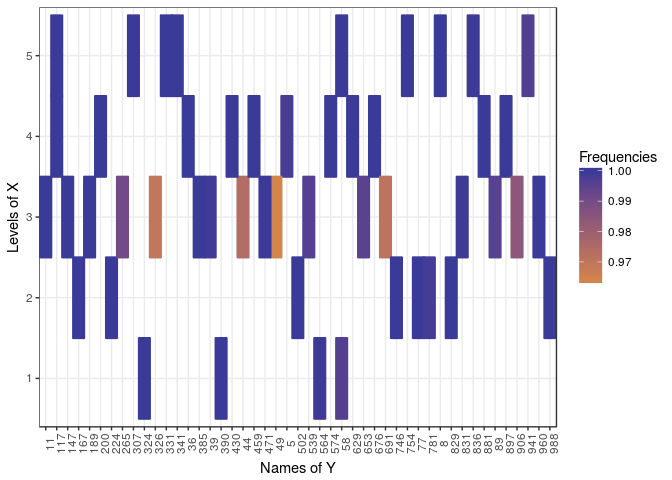

Introduction and installation
=============================

This vignette explains basic usage of , an R package to perform variable selection in the multivariate linear model taking into account the dependence that may exist between the responses. The model can be described as follows :
where *Y* is a *n* × *q* matrix of responses, *X* is a *n* × *p* matrix of covariables, *B* is a *p* × *q* sparse matrix of coefficients and *E* is a random error matrix such that ∀*i* ∈ {1, ⋯, *n*}, $E\_i = (E\_{i,1},\\dots,E\_{i,q})\\stackrel{iid}{\\sim}\\mathcal{N}(0,\\Sigma)$. The package consists in estimating *Σ* beforehand and to plug this estimator in a Lasso criterion, in order to obtain a sparse estimator of the coefficient matrix *B*.

The package has to be installed and then loaded as follows :

``` r
library(MultiVarSel)
```

Numerical experiments
=====================

We first show an application of our methodology to a simulated data set where the covariance matrix *Σ* is the covariance matrix of an AR(1) process.

Data generation
---------------

We start by generating a random error matrix *E* as described in the introduction as follows.

``` r
n <- 30
q <- 1000
p <- 5
rho <- 0.9
sparsity <- 0.01
E <- t(replicate(n, arima.sim(q, model = list(ar = rho, ma = 0))))
```

We then generate a sparse matrix *B* of coefficients and a matrix of covariables *X*.

``` r
s  <- round(sparsity * p * q) 
ij <- arrayInd(sample(1:(p * q), size = s), c(p, q))
values <- runif(s, 1, 2) * sample(c(-1, 1), s, replace = T)
B <- sparseMatrix(
  i = ij[, 1], j = ij[, 2],
  x = values,
  dims = c(p, q))
X <- matrix(rnorm(n * p), n, p)
Y <- X %*% B  + E
```

Whitening test
--------------

To apply our methodology we start by estimating the matrix *E* which is obtained by fitting a linear model with the design matrix *X* to all the columns of *Y* as if they were independent:

``` r
E_hat <- residuals(lm(as.matrix(Y) ~ X + 0))
```

We then use a Portmanteau test to check if each row of this matrix $\\widehat{E}$ is a white noise or not.

``` r
whitening_test(E_hat)
```

    ## [1] 0

The *p*-value is smaller than 0.05 hence we reject the hypothesis that each row of the residuals matrix is a white noise which is an expected result since each row of *E* is an AR(1) process.

Whitening
---------

We then try to remove the dependence among the columns of the residuals matrix by estimating the covariance matrix of the rows of *E*. To estimate it we try different structures for this covariance. The simplest assumption is that each row of *E* follows an AR(1) process, we also propose a modelling where each row is an ARMA(p,q) process and a nonparametric one where *Σ* is only assumed to be Toeplitz. To compare these different dependence modellings we perform a Portmanteau test on the "whitened" matrix $\\widehat{E}\\widehat{\\Sigma}^{-1/2}$, where $\\widehat{\\Sigma}^{-1/2}$ is the square root of the inverse of the estimation of *Σ*.

With the following code we test the AR(1), ARMA(1,1) and nonparametric dependence structures :

``` r
whitening_choice(E_hat, c("AR1", "ARMA", "nonparam"), pAR = 1, qMA = 1)
```

    ##          Pvalue    Decision
    ## AR1       0.457 WHITE NOISE
    ## ARMA 1 1  0.474 WHITE NOISE
    ## nonparam  0.947 WHITE NOISE

We then select the simplest model that allows us to remove the dependence in the data, in that case the AR(1) modelling. We compute the square root of the inverse of the estimator of the covariance matrix of each row of the residuals matrix using the AR(1) modelling as follows:

``` r
square_root_inv_hat_Sigma <- whitening(E_hat, "AR1", pAR = 1, qMA = 0)
```

In order to whiten the data (remove the dependence), we transform the data as follows:
The idea is then to use the Lasso criterion introduced by Tibshirani in 1996, and available in the R package on these whitened data. We recall that in the classical linear model
𝒴 = 𝒳ℬ + ℰ,
 where 𝒴, ℬ and ℰ are vectors and 𝒳 is a matrix, the Lasso estimator of ℬ is defined by
In order to be able to use the Lasso criterion we will apply the *v**e**c* operator to
Variable selection
------------------

The Lasso criterion applied to $\\mathcal{Y}=vec(\\boldsymbol{Y}\\widehat{\\boldsymbol{\\Sigma}}^{-1/2})$ will provide an estimation of the non null positions of ℬ = *v**e**c*(**B**) and hence the non null positions of *B*. In order to avoid false positive positions we add a stability selection step. These different steps (whitening, vectorization, Lasso, stability selection) are implemented in the function of the R package .

``` r
Frequencies <- variable_selection(Y = Y, X = X, nb_replis = 1000, typeDep =  "AR1", parallel = FALSE)
```

Parallel computing is also supported by this function. To make it work, users must download the package which is not available on Windows platforms (it is on others).

``` r
require(doMC)
```

    ## Loading required package: doMC

    ## Loading required package: iterators

``` r
registerDoMC(cores = 4)
Frequencies <- variable_selection(Y = Y, X = X, nb_replis = 1000, typeDep =  "AR1", parallel = TRUE)
```

In the previous command line, corresponds to the number of replications which is used in the stability selection. The following plot displays the frequencies at which each coefficient of *B* is considered as being non null.

``` r
p <- ggplot(data = Frequencies[Frequencies$Frequencies >= 0.95, ],
           aes(x = Names_of_Y, y = Names_of_X, color = Frequencies, fill = Frequencies)) +
           geom_tile(size = 0.75) + scale_color_gradient2(midpoint = 0.95, mid = 'orange')  + 
           scale_fill_gradient2(midpoint = 0.95, mid = 'orange') + theme_bw() + 
           theme(axis.text.x = element_text(angle=90)) +
           ylab('Levels of X') + xlab('Names of Y')
p
```



If we take a threshold of 0.95, meaning that we keep as non null values only the ones that are considered as non null in more than 95% of the times we have a True Positive Rate equal to 1 and a False Positive Rate equal to 0.

An exemple in metabolomics
==========================

In this section we study a LC-MS (Liquid Chromatography-Mass Spectrometry) data set made of African copals samples. The samples correspond to ethanolic extracts of copals produced by trees belonging to two genera Copaifera (C) and Trachylobium (T) with a second level of classification coming from the geographical provenance of the Copaifera samples (West (W) or East (E) Africa). Since all the Trachylobium samples come from East Africa, we can use the modeling proposed in where *X* is a one-way ANOVA design matrix with 3 levels. Our goal is to identify the most important features (the *m*/*z* values) characterizing the different levels.

``` r
data("copals_camera")
Y <- scale(Y) 
```

We build the design matrix as follows

``` r
X <- model.matrix( ~ group + 0)
```

We start by computing the residuals of the one-way ANOVA model.

``` r
E_hat <- residuals(lm(as.matrix(Y) ~ X + 0))
```

Then we test if the columns of the residuals are independent using the Portmanteau test.

``` r
whitening_test(E_hat)
```

    ## [1] 0

The *p*-value is smaller than 0.05 and thus the hypothesis that each row of *E* is a white noise is rejected. We try our different covariance modellings for the residuals and see if one manages to remove the dependence among the columns of the residuals matrix by using a Portmanteau test.

``` r
whitening_choice(E_hat, c("AR1", "nonparam", "ARMA"), pAR = 1, qMA = 1)
```

    ##          Pvalue       Decision
    ## AR1           0 NO WHITE NOISE
    ## nonparam  0.664    WHITE NOISE
    ## ARMA 1 1      0 NO WHITE NOISE

From this result, we observe that the non parametric modelling is the only one which removes the dependence.

In this application, the design matrix *X* is the design matrix of a one-way ANOVA. In that scenario we recommend to use the argument "your qualitative variable" in the function. This argument will ensure that in the cross-validation the different fold are homogeneously distributed among the levels of the qualitative variable.

``` r
Frequencies <- 
  variable_selection(
    Y = Y, 
    group = group, 
    nb_replis = 1000, 
    typeDep = 'ARMA', 
    pAR = 1, qMA = 1,
    parallel = TRUE
  )
```

The following plot displays the frequencies at which each coefficient of *B* is considered as being non null which corresponds to the features (*m*/*z* values) characterizing the different levels.

``` r
Frequencies$Names_of_Y <- as.numeric(gsub('X','',Frequencies$Names_of_Y))

p<-ggplot(data=Frequencies[Frequencies$Frequencies>=0.999,],
               aes(x = Names_of_Y, y = Names_of_X, color = Names_of_X, fill = Names_of_X)) + 
               geom_point() + theme_bw() + 
               theme(text= element_text(face ="bold", size = 12))
p
```


Session Info
============

    ## R version 3.4.4 (2018-03-15)
    ## Platform: x86_64-pc-linux-gnu (64-bit)
    ## Running under: Ubuntu 16.04.4 LTS
    ## 
    ## Matrix products: default
    ## BLAS: /usr/lib/libblas/libblas.so.3.6.0
    ## LAPACK: /usr/lib/lapack/liblapack.so.3.6.0
    ## 
    ## locale:
    ##  [1] LC_CTYPE=fr_FR.UTF-8       LC_NUMERIC=C              
    ##  [3] LC_TIME=fr_FR.UTF-8        LC_COLLATE=fr_FR.UTF-8    
    ##  [5] LC_MONETARY=fr_FR.UTF-8    LC_MESSAGES=fr_FR.UTF-8   
    ##  [7] LC_PAPER=fr_FR.UTF-8       LC_NAME=C                 
    ##  [9] LC_ADDRESS=C               LC_TELEPHONE=C            
    ## [11] LC_MEASUREMENT=fr_FR.UTF-8 LC_IDENTIFICATION=C       
    ## 
    ## attached base packages:
    ## [1] parallel  stats     graphics  grDevices utils     datasets  methods  
    ## [8] base     
    ## 
    ## other attached packages:
    ##  [1] doMC_1.3.4        iterators_1.0.9   MultiVarSel_1.1.2
    ##  [4] forcats_0.3.0     stringr_1.3.0     dplyr_0.7.4      
    ##  [7] purrr_0.2.4       readr_1.1.1       tidyr_0.8.0      
    ## [10] tibble_1.4.2      ggplot2_2.2.1     tidyverse_1.2.1  
    ## [13] glmnet_2.0-16     foreach_1.4.4     Matrix_1.2-13    
    ## 
    ## loaded via a namespace (and not attached):
    ##  [1] reshape2_1.4.3   haven_1.1.1      lattice_0.20-35  colorspace_1.3-2
    ##  [5] htmltools_0.3.6  yaml_2.1.18      rlang_0.2.0      pillar_1.2.1    
    ##  [9] foreign_0.8-69   glue_1.2.0       modelr_0.1.1     readxl_1.0.0    
    ## [13] bindrcpp_0.2     bindr_0.1        plyr_1.8.4       munsell_0.4.3   
    ## [17] gtable_0.2.0     cellranger_1.1.0 rvest_0.3.2      codetools_0.2-15
    ## [21] psych_1.8.3.3    evaluate_0.10.1  labeling_0.3     knitr_1.20      
    ## [25] broom_0.4.4      Rcpp_0.12.16     backports_1.1.2  scales_0.5.0    
    ## [29] jsonlite_1.5     mnormt_1.5-5     hms_0.4.2        digest_0.6.15   
    ## [33] stringi_1.1.7    grid_3.4.4       rprojroot_1.3-2  cli_1.0.0       
    ## [37] tools_3.4.4      magrittr_1.5     lazyeval_0.2.0   crayon_1.3.4    
    ## [41] pkgconfig_2.0.1  xml2_1.2.0.9000  lubridate_1.7.3  assertthat_0.2.0
    ## [45] rmarkdown_1.9    httr_1.3.1       rstudioapi_0.7   R6_2.2.2        
    ## [49] nlme_3.1-131.1   compiler_3.4.4
