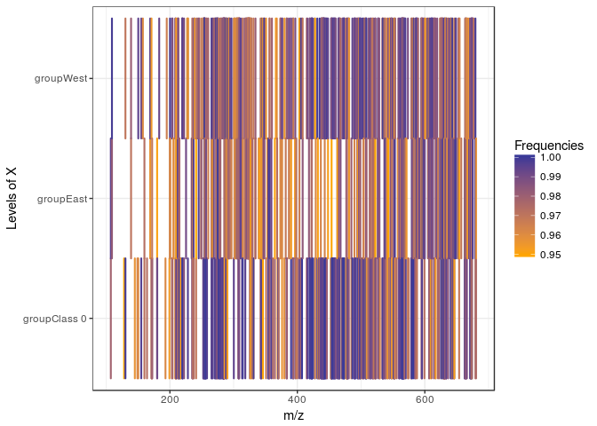

MultiVarSel
===========

This is an R package to perform variable selection in the multivariate linear model taking into account the dependence that may exist between the responses. It consists in estimating beforehand the covariance matrix *Σ* of the responses and to plug this estimator in a Lasso criterion, in order to obtain a sparse estimator of the coefficient matrix.

Introduction and Installation
-----------------------------

This vignette explains how to use the package which is dedicated to the variable selection in high-dimensional linear models taking into account the dependence that may exist between the columns of the observations matrix. The model can be described as follows :

where *Y* is a *n* × *q* matrix of responses, *X* is a *n* × *p* matrix of covariables, *B* is a *p* × *q* sparse matrix of coefficients and *E* is a random error matrix such that ∀*i* ∈ {1, ⋯, *n*}, *E*<sub>*i*</sub> = (*E*<sub>*i*, 1</sub>, …, *E*<sub>*i*, *q*</sub>)∼𝒩(0, *Σ*). The package consists in estimating *Σ* beforehand and to plug this estimator in a Lasso criterion, in order to obtain a sparse estimator of the coefficient matrix *B*.

The package has to be installed and then loaded as follows :

``` r
# devtools::install_github("Marie-PerrotDockes/MultiVarSel")
library(MultiVarSel)
```

    ## Loading required package: glmnet

    ## Loading required package: Matrix

    ## Loading required package: foreach

    ## Loaded glmnet 2.0-16

    ## Loading required package: parallel

    ## Loading required package: tidyverse

    ## ── Attaching packages ───────────────────────────────────────────── tidyverse 1.2.1 ──

    ## ✔ ggplot2 2.2.1     ✔ purrr   0.2.4
    ## ✔ tibble  1.4.2     ✔ dplyr   0.7.4
    ## ✔ tidyr   0.8.0     ✔ stringr 1.3.0
    ## ✔ readr   1.1.1     ✔ forcats 0.3.0

    ## ── Conflicts ──────────────────────────────────────────────── tidyverse_conflicts() ──
    ## ✖ purrr::accumulate() masks foreach::accumulate()
    ## ✖ tidyr::expand()     masks Matrix::expand()
    ## ✖ dplyr::filter()     masks stats::filter()
    ## ✖ dplyr::lag()        masks stats::lag()
    ## ✖ purrr::when()       masks foreach::when()

Numerical experiment
--------------------

We first show an application of our methodology to a simulated data set where the covariance matrix *Σ* is the covariance matrix of an AR(1) process. We start by generating a random error matrix *E* as described in the Introduction as follows.

``` r
n <- 30
q <- 100
p <- 5
rho <- 0.9
sparsity <- 0.01

E <- t(sapply(1:n,function(i){
  as.numeric(arima.sim(q,model=list(ar = rho, ma = 0)))
}))
```

We then generate a sparse matrix *B* of coefficients and a matrix of covariables *X*.

``` r
s  <- round(sparsity*p*q) 
ij <- arrayInd(sample(1:(p*q), size = s), c(p,q))
B <- sparseMatrix(i = ij[, 1], j = ij[, 2],
                   x = runif(s, 1, 2) * sample(c(-1,1),s,rep=T),
                   dims = c(p,q))

X <- matrix(rnorm(n*p),n,p)
   
Y <- X %*% B  + E
```

To apply our methodology we start by estimating the matrix *E* by computing the residuals independently on all the columns of *Y*:

``` r
residual <- lm(as.matrix(Y) ~ X - 1)$residuals
```

We then use a Portmanteau test to check if each row of this matrix $\\widehat{E}$ is a white noise or not.

``` r
whitening_test(residual)
```

    ## [1] 0

The *p* − *v**a**l**u**e* is really small hence we reject the hypothesis that each row of the residual matrix is a white noise which is an expected result since each row of *E* is an AR(1) process.

We then try to remove the dependence among the columns of the residuals matrix by estimating the covariance matrix of the rows of *E*. To estimate it we try different structures for this covariance. The simplest assumption is that each row of *E* follows an *A**R*(1) process, we also propose a modelisation where each row is an *A**R**M**A*(*p*, *q*) process and a nonparametric one where *Σ* is only assumed to be Toeplitz. To compare this different estimations we perform a Portmenteau test on the "whithened" matrix $\\widehat{E}\\widehat{\\Sigma}^{-1/2}$, where $\\hat{\\Sigma^{-1/2}}$ is the square root of the inverse of the estimation of *Σ*.

With the following code we test the AR(1), ARMA(1,1) and nonparametric dependence structures :

``` r
result <- whitening_choice(residual, c("AR1","ARMA","nonparam"), pAR = 1, qMA = 1)
result
```

    ##          Pvalue    Decision
    ## AR1       0.509 WHITE NOISE
    ## ARMA 1 1  0.507 WHITE NOISE
    ## nonparam  0.937 WHITE NOISE

We then select the simplest model that allows us to remove the dependence in the data, in that case the *A**R*(1) modelling. We compute the square root of the inverse of the estimator of the covariance matrix of each row of the residuals matrix using the *A**R*(1) modelling as follows:

``` r
square_root_inv_hat_Sigma <- whitening(residual, "AR1", pAR = 1, qMA = 0)
```

In order to whiten the data (remove the dependence), we transform the data as follows:
The idea is then to use the Lasso criterion introduced by Tibshirani in 1996, and available in the R package on these whitened data. We recall that in the classical linear model
𝒴 = 𝒳ℬ + ℰ,
 where 𝒴, ℬ and ℰ are vectors and 𝒳 is a matrix, the Lasso estimator of ℬ is defined by
In order to be able to use the Lasso criterion we will apply the vec operator to
The Lasso criterion applied to $\\mathcal{Y}}=vec(\\boldsymbol{Y}\\widehat{\\boldsymbol{\\Sigma}}\_q^{-1/2})$ will provide an estimation of the non null positions of ℬ = *v**e**c*(**B**) and hence the non null positions of *B*. In order to avoid false positive positions we add a stability selection step. These different steps (whitening, vectorization, Lasso, stability selection) are implemented in the function of the R package .

``` r
Frequencies=variable_selection(Y = Y, X = X, nb_repli = 50, typeDep =  "AR1")
```

In the previous command line, corresponds to the number of replications which is used in the stability selection. Here it is equal to 50 but in practice we recommend to take it equal to 1000. The following plot displays the frequencies at which each coefficient of *B* is considered as being non null.

``` r
p <- ggplot(data = Frequencies[Frequencies$Frequencies >= 0.95, ],
           aes(x = Names_of_Y, y = Names_of_X, color = Frequencies, fill = Frequencies)) +
           geom_tile(size = 0.75) + scale_color_gradient2(midpoint = 0.95, mid = 'orange')  + scale_fill_gradient2(midpoint = 0.95, mid = 'orange') +
           theme_bw() + ylab('Levels of X') + xlab('Names of Y')
p
```


If we take a threshold of 0.95, meaning that we keep as non null values only the ones that are considered as non null in more than 95% of the times we have a True Positive Rate equal to 1 and a False Positive Rate equal to 0.

An exemple in metabolomics
--------------------------

In this section we study a LC-MS (Liquid Chromatography-Mass Spectrometry) data set made of African copals samples. The samples correspond to ethanolic extracts of copals produced by trees belonging to two genera Copaifera (C) and Trachylobium (T) with a second level of classification coming from the geographical provenance of the Copaifera samples (West (W) or East (E) Africa). Since all the Trachylobium samples come from East Africa, we can use the modeling proposed in where *X* is a one-way ANOVA design matrix with 3 levels. Our goal is to identify the most important features (the m/z values) characterizing the different levels. In order to have a fast and reproducible example we focus in this section on the 200 first metabolites (*q* = 200) but our package can handle much larger datasets (up to *q* = 5000 in a few minutes).

``` r
data("copals_camera")
Y <- Y %>%  as.data.frame() %>% select(1:200) %>% scale()
```

We build the design matrix as follows

``` r
X <- model.matrix( ~ group + 0)
```

We start by computing the residuals of the one-way ANOVA model for each metabolite independently.

``` r
residuals=lm(as.matrix(Y) ~ X - 1)$residuals
```

Then we test if the columns of the residuals are independent using the Portmanteau test.

``` r
whitening_test(residuals)
```

    ## [1] 5.676735e-229

The *p* − *v**a**l**u**e* is really small and thus the hypothesis that each row of *E* is a white noise is rejected. We try our different covariance modellings for the residuals and see if one manages to remove the dependence among the columns of the residuals matrix by using a Portmanteau test.

``` r
result=whitening_choice(residuals, c("AR1", "nonparam", "ARMA"), pAR = 1, qMA = 1)
result
```

    ##          Pvalue       Decision
    ## AR1           0 NO WHITE NOISE
    ## nonparam  0.992    WHITE NOISE
    ## ARMA 1 1  0.653    WHITE NOISE

From this result, we observe that the *A**R*(1) modelling does not remove the dependence among the data but the two others do. We select the *A**R**M**A*(1, 1) modelling which is simpler than the nonparametric one.

In this application, the design matrix *X* is the design matrix of a one-way ANOVA. In that scenario we recommend to use the argument "your qualitative variable" in the function. This argument will ensure that in the cross-validation the different fold are homogeneously distributed among the levels of the qualitative variable.

``` r
Frequencies <- variable_selection(Y = Y, group = group, nb_repli = 100, typeDep = 'ARMA', pAR = 1, qMA = 1)
```

The following plot displays the frequencies at which each coefficient of *B* is considered as being non null which corresponds to the features (m/z values) characterizing the different levels.

``` r
Frequencies$Names_of_Y <- as.numeric(gsub('X','',Frequencies$Names_of_Y))
p <- ggplot(data = Frequencies[Frequencies$Frequencies >= 0.95, ],
           aes(x = Names_of_Y, y = Names_of_X, color = Frequencies, fill = Frequencies)) +
           geom_tile(size = 0.75) + scale_color_gradient2(midpoint = 0.95, mid = 'orange')  + scale_fill_gradient2(midpoint = 0.95, mid = 'orange') +
           theme_bw() + ylab('Levels of X') + xlab('m/z')
p
```



Hereafter, we also provide some information about the R session

``` r
 sessionInfo()
```

    ## R version 3.4.4 (2018-03-15)
    ## Platform: x86_64-pc-linux-gnu (64-bit)
    ## Running under: Ubuntu 16.04.4 LTS
    ## 
    ## Matrix products: default
    ## BLAS: /usr/lib/libblas/libblas.so.3.6.0
    ## LAPACK: /usr/lib/lapack/liblapack.so.3.6.0
    ## 
    ## locale:
    ##  [1] LC_CTYPE=fr_FR.UTF-8       LC_NUMERIC=C              
    ##  [3] LC_TIME=fr_FR.UTF-8        LC_COLLATE=fr_FR.UTF-8    
    ##  [5] LC_MONETARY=fr_FR.UTF-8    LC_MESSAGES=fr_FR.UTF-8   
    ##  [7] LC_PAPER=fr_FR.UTF-8       LC_NAME=C                 
    ##  [9] LC_ADDRESS=C               LC_TELEPHONE=C            
    ## [11] LC_MEASUREMENT=fr_FR.UTF-8 LC_IDENTIFICATION=C       
    ## 
    ## attached base packages:
    ## [1] parallel  stats     graphics  grDevices utils     datasets  methods  
    ## [8] base     
    ## 
    ## other attached packages:
    ##  [1] MultiVarSel_1.1.2 forcats_0.3.0     stringr_1.3.0    
    ##  [4] dplyr_0.7.4       purrr_0.2.4       readr_1.1.1      
    ##  [7] tidyr_0.8.0       tibble_1.4.2      ggplot2_2.2.1    
    ## [10] tidyverse_1.2.1   glmnet_2.0-16     foreach_1.4.4    
    ## [13] Matrix_1.2-13    
    ## 
    ## loaded via a namespace (and not attached):
    ##  [1] reshape2_1.4.3   haven_1.1.1      lattice_0.20-35  colorspace_1.3-2
    ##  [5] htmltools_0.3.6  yaml_2.1.18      rlang_0.2.0      pillar_1.2.1    
    ##  [9] foreign_0.8-69   glue_1.2.0       modelr_0.1.1     readxl_1.0.0    
    ## [13] bindrcpp_0.2     bindr_0.1        plyr_1.8.4       munsell_0.4.3   
    ## [17] gtable_0.2.0     cellranger_1.1.0 rvest_0.3.2      codetools_0.2-15
    ## [21] psych_1.8.3.3    evaluate_0.10.1  labeling_0.3     knitr_1.20      
    ## [25] broom_0.4.4      Rcpp_0.12.16     backports_1.1.2  scales_0.5.0    
    ## [29] jsonlite_1.5     mnormt_1.5-5     hms_0.4.2        digest_0.6.15   
    ## [33] stringi_1.1.7    grid_3.4.4       rprojroot_1.3-2  cli_1.0.0       
    ## [37] tools_3.4.4      magrittr_1.5     lazyeval_0.2.0   crayon_1.3.4    
    ## [41] pkgconfig_2.0.1  xml2_1.2.0.9000  lubridate_1.7.3  assertthat_0.2.0
    ## [45] rmarkdown_1.9    httr_1.3.1       rstudioapi_0.7   iterators_1.0.9 
    ## [49] R6_2.2.2         nlme_3.1-131.1   compiler_3.4.4
